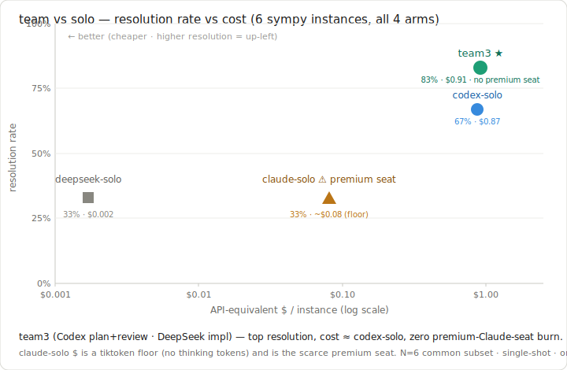

# swe_probe — heterogeneous team vs solo, on SWE-bench-Lite

Answers the EXISTENTIAL gap (STATUS #1) and upgrades bench from proxy→objective (#2):

> Does a **heterogeneous team** (a cheap brain plans/reviews, a cheaper meter
> implements) hold resolution-rate vs the **best single model**, while burning far
> less scarce **premium-seat quota**?

The edge is **cross-vendor cost-arbitrage**: bulk implementation moves to a ~1-2
orders cheaper meter (DeepSeek V4-flash, $0.14/$0.28 per M) while a stronger model
only plans/reviews — and **no premium Claude seat is consumed at all**. The current
champion arm is `team3` (Codex plans+reviews · DeepSeek implements); see Results.

## Design (keeps it cheap + honest)

- **Oracle retrieval** — every arm gets exactly the files the gold patch edits.
  Measures *patch generation*, not retrieval. No repo-wide exploration = low Claude quota.
- **Single shot for solos** — `claude-solo`/`codex-solo`/`deepseek-solo` get one pass,
  no agentic retry. `team3` is allowed an internal review→revise loop (that *is* the
  teamwork being measured), gated before the expensive Docker eval.
- **4 arms:** `claude-solo` (you, the premium seat, authored BLIND), `codex-solo`
  (strong ChatGPT-sub seat), `deepseek-solo` (cheap trap baseline), `team3` (Codex
  plans → DeepSeek implements → Codex reviews → revise; champion). The thin `team`
  (plan-once → DeepSeek → pytest-retry) is retained for back-compat.
- **Objective scoring** — official swebench harness in Docker → `resolved: true/false`.
- **gold-validate gate** — score the gold patch first; if it doesn't resolve, the
  env/scorer is wrong → don't trust arm scores.

### Patch generation (robust-apply, since flask-5063 round)

DeepSeek (and claude-solo) return the **whole updated content** of each changed
file inside `@@@FILE <path>` / `@@@ENDFILE` markers; `run.py` computes the unified
diff locally against the bundle's base content (`_files_to_patch`). This kills the
apply-fail confound — small models routinely emit diffs with wrong `@@` line
numbers that `git apply` rejects, so we'd be scoring diff-arithmetic, not logic.
Every arm uses the same machinery → all patches apply cleanly.

- `max_tokens = 16000` (cli.py-sized files exceed the old 8000 cap → truncation → empty parse).
- **Backlog:** whole-file still doesn't scale to very large files → switch to
  search/replace blocks (Aider-style, emit only the changed region).
- **`codex-solo` / `team3` return a real `git diff`** (codex edits staged oracle
  files in a temp git repo), so they skip the whole-file step — usage + agent turns
  come from the `codex exec` event stream (`codex.py`).
- **review gates, doesn't ghost-write** — in `team3` the Codex reviewer emits
  `VERDICT: PASS|REVISE` + notes; a REVISE re-implements (no eval), only a PASS goes
  to Docker. The reviewer does not hand-write the patch, so team-value stays measurable.

## Privacy

DeepSeek = PRC servers; code leaves the machine. Only public OSS instances here. Never
run proprietary code through the DeepSeek arms.

## One-time setup

DeepSeek key (already set this machine):
```powershell
$env:DEEPSEEK_API_KEY   # must be non-empty
```

swebench scorer **runs in WSL, not Windows native** — `import resource` is Unix-only and
fails at import time on every Windows command (py3.14 also lacks `datasets`/`swebench`
wheels). `run.py` auto-detects Windows and shells into WSL Ubuntu (`wsl_eval.sh`,
path-translating `/mnt/e/...`). One-time setup (idempotent):
```powershell
wsl -d Ubuntu bash /mnt/e/portable-harness/bench/swe_probe/wsl_setup.sh
```
This installs swebench in WSL (py3.12.3, `pip install --user --break-system-packages`)
and checks the Docker Desktop bridge (`docker_ok`).

Docker Desktop must be running (WSL integration on). flask env-image caches after the
first eval (~1-2 min/eval after). Subset footprint ≈ 10–20 GB; `docker system prune -a` reclaims.

## Run (per instance)

```powershell
# 0. pick a hermetic instance + verify env  (requests = NON-hermetic, needs httpbin → rejected;
#    sympy = pure-python, hermetic + hard enough to separate arms. flask Lite is too easy.)
py -m bench.swe_probe.run instances --repo sympy/sympy        # list real ids
py -m bench.swe_probe.run pull <id>
py -m bench.swe_probe.run gold-validate <id>                  # MUST say PASS (env trustworthy)

# 1. deepseek-solo (cheap trap baseline) — automated
py -m bench.swe_probe.run deepseek-solo <id>
py -m bench.swe_probe.run eval <id> deepseek-solo

# 2. codex-solo (strong ChatGPT-sub seat) — automated; real diff + usage/turns
py -m bench.swe_probe.run codex-solo <id>
py -m bench.swe_probe.run eval <id> codex-solo

# 3. team3 (champion: Codex plan → DeepSeek impl → Codex review → revise) — self-evals in loop
py -m bench.swe_probe.run team3 <id> --max-iter 3

# 4. claude-solo (the premium seat) — author the patch BLIND (read only problem +
#    oracle_files, NEVER the gold_patch), write a .diff, register + log tokens + eval
py -m bench.swe_probe.run claude-patch  <id> claude-solo --file my.diff
py -m bench.swe_probe.run claude-tokens <id> claude-solo --in-file read.txt --out-file my.diff
py -m bench.swe_probe.run eval          <id> claude-solo

# 5. read the scorecard (resolution + api_usd money axis across arms)
py -m bench.swe_probe.run report
```

## Reading the result

`win = team3 resolves ≥ best solo, at ≈/lower api_usd, with ZERO premium-Claude-seat burn.`

- `team3` resolves what the best solo resolves (or more, via the review/revise loop)
  → **quality holds — and improves — off the premium seat**.
- `api_usd` = every member's in+out+reasoning at API list rate, one currency. The sub
  seats are priced at opportunity cost (not a fake $0), so "team adds DeepSeek cents"
  is compared honestly against "solo burns the scarce seat". claude-solo's number is a
  tiktoken **floor** (misses hidden thinking tokens).
- `deepseek-solo` is the trap: if it already resolves a task cheap, the team overhead
  is pointless there — team-value shows up on the *hard* instances it fails.

## Results (N=8 sympy, 2026-06-25 — thesis holds)



The arm set evolved: the thin `team` handoff → **`team3`** (real 3-role: Codex
plans → DeepSeek implements → Codex reviews → revise loop over a blackboard), plus
**`codex-solo`** (a strong ChatGPT-sub seat). Cost is now a real money axis (`api_usd`)
— every member priced at API list rate, one currency, so the scarce premium Claude
seat is counted at opportunity cost, not a fake $0.

Resolution on the 6 sympy instances where **all four arms** ran (claude-solo subset):

| arm | resolved | avg api_usd/inst | premium seat? |
|---|---|---|---|
| **team3** | **5/6 (83%)** | $0.91 | **no** |
| codex-solo | 4/6 (67%) | $0.87 | no |
| claude-solo | 2/6 (33%) | ~$0.08 (floor) | **yes** |
| deepseek-solo | 2/6 (33%) | $0.002 | no |

(Over the full 8 sympy: team3 5/8 > codex-solo 4/8 > deepseek-solo 2/8; claude-solo
authored on 6.)

**The decider — `sympy-11400`:** both strong solos fail single-shot (each emits
`_print_sinc` but misses `_print_Relational`, so the `Ne(x,0)` condition prints
instead of `x != 0` → `test_ccode_Relational` + `test_ccode_sinc` fail). `team3`
resolves it because the Codex review/revise loop (3 iters) catches the gap and adds
`_print_Relational` — and does so **cheaper** ($0.968 < codex-solo $1.014). This is
the heterogeneous-team thesis in one instance: *iteration-on-review beats a stronger
single-shot solo, off the premium seat.*

**Takeaway:** team3 (Codex brain + DeepSeek hands) ≥ best solo on resolution, cost
≈/better on hard instances, and burns **zero** premium Claude quota. claude-solo is
dominated — same resolution as the cheapest arm while consuming the scarce seat.

⚠️ **Caveats:** N=8, one repo, single-shot, oracle retrieval. `claude-solo` api_usd
is a tiktoken **floor** (misses hidden thinking tokens); codex input is not
cache-discounted (upper bound). Direction is robust; magnitude is soft.

## Phases

- **A (here):** does quality hold + quota shift? (the load-bearing risk)
- **B (later, arithmetic):** project token split onto the real seat model
  (Claude flat-but-capped + DeepSeek meter) → "stretches my Max quota by X".
