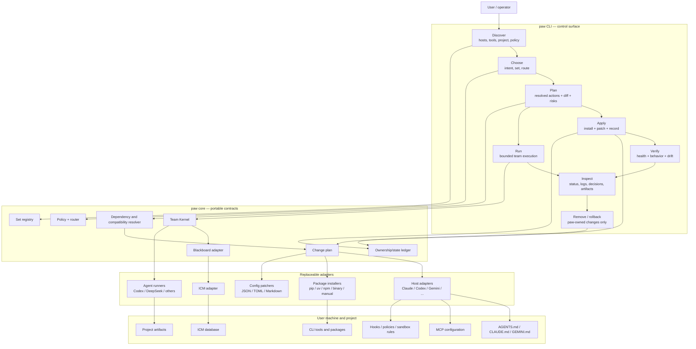
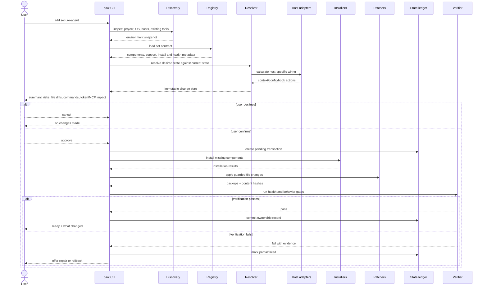
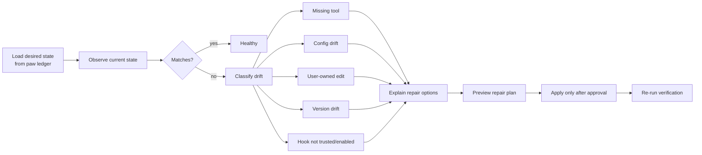
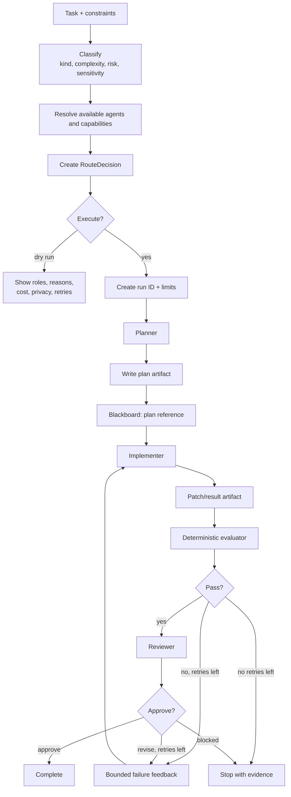
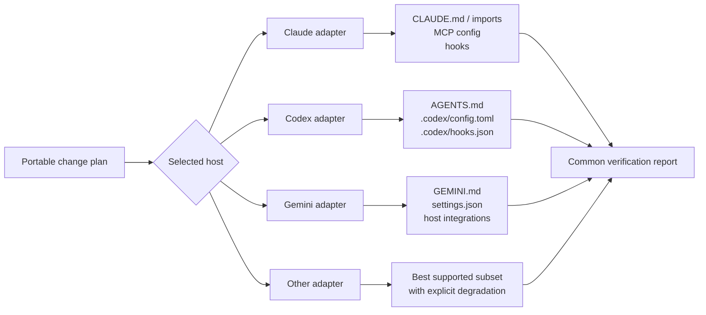
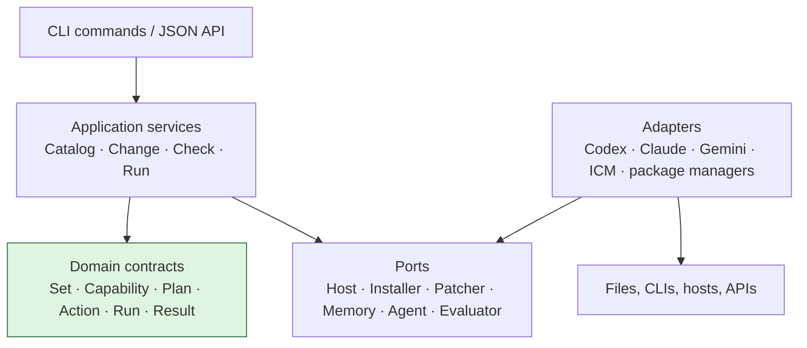
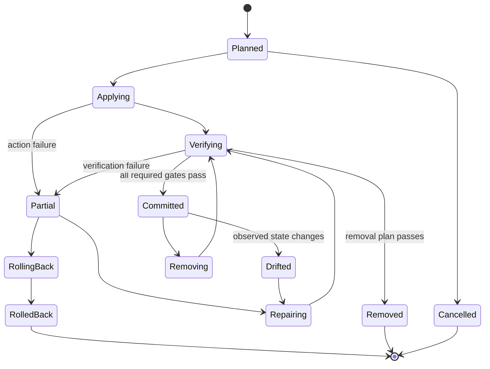
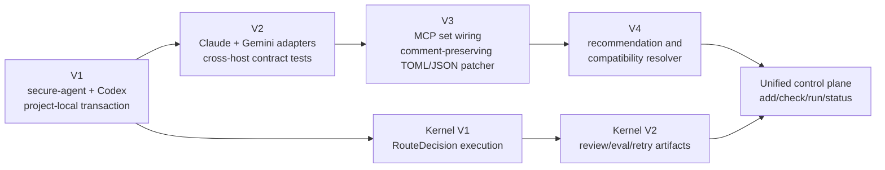

# paw CLI workflow — discussion draft

> Status: product/UX exploration, not an implementation contract.
>
> Purpose: make the whole paw system visible before choosing command names,
> interaction style, or implementation order.

## 1. What paw is trying to be

paw is not another general-purpose agent framework. It is a portable control
plane that helps a person:

1. understand which agent capabilities are available;
2. choose a small, compatible bundle for the current job;
3. wire that bundle into one or more agent hosts without clobbering user config;
4. route work across agents under explicit privacy, cost, and retry limits;
5. share bounded state between agents;
6. verify the resulting installation and runtime behavior;
7. remove or roll back only what paw owns.

The product promise is therefore larger than “install some tools”:

```text
intent
  → recommended capability set
  → previewed machine changes
  → safely applied host wiring
  → verified usable environment
  → bounded agent execution
  → inspectable result
  → reversible ownership
```

## 2. Current truth

### Live now

- `paw sets list`
- `paw sets show <name>`
- `paw route <task> ...`
- `paw blackboard write ...`
- `paw blackboard read ...`
- curated registry with eight sets
- deterministic route decision with privacy/budget/fallback policy
- ICM-backed shared blackboard
- project-local Codex configuration and hooks
- local compatibility evidence for several bundle tools

### Planned, but not implemented

- host/environment discovery as a user-facing command
- installation planning and dry-run diff
- tool installation orchestration
- managed context injection
- MCP/config patching
- hook wiring
- persistent ownership/state ledger
- `verify`
- `unlink` or rollback
- Team Kernel execution of a `RouteDecision`

### Important distinction

Today, `paw route` makes a decision but does not execute it.

Today, `paw sets show` describes a set but does not install or wire it.

This gap is central to the new CLI design.

## 3. System map



## 4. The three user journeys

The CLI currently mixes three different jobs. A good redesign should make them
feel related without pretending they are the same operation.

### Journey A — prepare the environment

“Make this project ready for secure agent work.”

```text
inspect machine/project
  → recommend set
  → preview installations and file edits
  → obtain confirmation
  → install missing tools
  → patch selected hosts
  → verify health and behavior
  → save ownership ledger
```

This is the future bundle-linker journey.

### Journey B — execute work

“Take this task and use the right team under my limits.”

```text
classify task
  → choose route
  → show cost/privacy/retry contract
  → execute planner
  → hand off plan
  → execute implementer
  → evaluate
  → review
  → retry or stop
  → present result and artifacts
```

This is the future Team Kernel journey.

### Journey C — operate and maintain

“Tell me what paw owns, what is broken, and how to get back to a clean state.”

```text
inspect state
  → detect drift
  → verify tools/config/hooks
  → explain discrepancies
  → repair, upgrade, unlink, or roll back
```

This is the lifecycle/operations journey.

## 5. Proposed product-level command model

This is deliberately a semantic model, not yet a final command syntax.

```text
paw
├── setup       Prepare paw itself and establish local state
├── add         Add a capability set to selected host/project scopes
├── remove      Remove paw-owned wiring for a set
├── plan        Preview resolved actions without mutating anything
├── check       Verify installation, behavior, compatibility, and drift
├── run         Route and execute a task
├── status      Summarize current project/host/set/run state
├── inspect     Show detailed evidence for one object
└── catalog     Browse available sets and components
```

Possible mapping from current commands:

| Current | Product meaning | Possible future home |
| --- | --- | --- |
| `sets list` | browse catalog | `catalog` |
| `sets show` | inspect catalog item | `inspect set` or `catalog show` |
| `route` | preview execution decision | `plan run` or `run --dry-run` |
| `blackboard read/write` | low-level team state operation | hidden/internal by default; advanced namespace |
| none | add/wire set | `add` |
| none | verify environment | `check` |
| none | remove ownership | `remove` |
| none | execute route | `run` |

### UX question: nouns or verbs?

Two coherent styles are possible.

#### Verb-first

```text
paw add secure-agent
paw check
paw run "fix the parser"
paw remove secure-agent
```

Advantages:

- reads like user intent;
- short common path;
- avoids exposing internal architecture.

Tradeoff:

- object-specific options can accumulate on top-level commands.

#### Resource-first

```text
paw set add secure-agent
paw set check secure-agent
paw task run "fix the parser"
paw host inspect codex
```

Advantages:

- systematic and extensible;
- good for scripting and discovery.

Tradeoff:

- heavier for everyday use;
- can feel like an infrastructure admin CLI.

Initial design bias: verb-first for human workflows, stable JSON objects for
automation, and resource nouns only under `inspect` or an advanced namespace.

## 6. End-to-end add workflow

Example intent:

```text
paw add secure-agent
```

The short command must not imply a blind install. Internally it expands into a
transaction-like workflow.



### Add workflow phases

#### 1. Discovery

Collect without mutation:

- repository root and project identity;
- operating system and architecture;
- detected agent hosts;
- active project and user configuration layers;
- existing CLI binaries and versions;
- existing MCP servers;
- existing hooks and their trust state where observable;
- current managed blocks;
- package manager availability;
- whether the working tree contains overlapping edits;
- prior paw state ledger.

#### 2. Resolution

Transform a set into a concrete desired state:

- components already satisfied;
- components missing;
- unsupported components;
- optional components;
- conflicts and mutually exclusive tools;
- host-specific replacements;
- expected MCP count and token impact;
- secrets or environment variables required;
- project-scoped versus user-scoped wiring;
- actions that require manual completion.

#### 3. Plan

Produce a reviewable object before mutation:

```json
{
  "schema": "paw-change-plan/v1",
  "intent": "add-set",
  "set": "secure-agent",
  "scope": {
    "project": "E:/portable-harness",
    "hosts": ["codex"],
    "config_scope": "project"
  },
  "actions": [],
  "warnings": [],
  "verification": [],
  "rollback": []
}
```

Every action should declare:

- action ID;
- mutation type;
- target;
- before-state fingerprint;
- desired change;
- reversibility;
- required approval;
- verification gate;
- rollback action.

#### 4. Apply

Rules:

- check the before-state fingerprint immediately before every write;
- preserve comments and unrelated configuration;
- use managed blocks for context text;
- back up or record exact before-state;
- never claim ownership of pre-existing user configuration;
- stop on unexpected drift;
- do not continue into dependent actions after a failed prerequisite;
- redact secrets from output and state.

#### 5. Verify

Verification should be layered:

1. presence — binary/file/config exists;
2. syntax — config parses;
3. startup — tool or host can load;
4. integration — the host sees the intended capability;
5. behavior — one small safe probe proves the capability works;
6. policy — MCP ceiling, privacy, and security constraints still hold.

#### 6. Commit ownership

Only verified actions become committed paw state.

The ledger should distinguish:

- installed by paw;
- pre-existing and reused;
- configured by paw;
- manually completed by the user;
- failed or partially applied;
- drifted after installation.

## 7. Check and repair workflow



Suggested health states:

| State | Meaning |
| --- | --- |
| `healthy` | desired and observed state match; probes pass |
| `degraded` | usable, but one optional or weaker guarantee is missing |
| `drifted` | a paw-owned target changed after application |
| `partial` | some actions applied but transaction did not complete |
| `blocked` | required dependency, permission, secret, or host support missing |
| `unknown` | paw cannot safely determine current state |

The CLI should avoid a vague red/green result. It should answer:

- What works?
- What does not?
- Who owns the affected state?
- Is it safe to repair automatically?
- What exact change would repair it?

## 8. Remove and rollback workflow

`remove` and `rollback` are related but different.

### Remove

Move from the currently committed desired state to a new desired state without
the selected set.

```text
current ledger
  → calculate which paw-owned changes are no longer needed
  → retain shared dependencies still used by another set
  → preview removals
  → guard against user drift
  → remove managed wiring
  → optionally uninstall paw-installed binaries
  → verify remaining environment
  → commit new state
```

### Rollback

Restore the exact recorded before-state for a particular failed or completed
transaction.

Rollback must stop when:

- the target changed since paw last wrote it;
- restoring would overwrite user edits;
- another installed set now depends on the same action;
- the old binary/config is no longer safely restorable.

In those cases, paw should generate a manual recovery plan rather than forcing
the rollback.

## 9. Task routing and execution workflow

The runtime path should share policy and status concepts with installation, but
it should not be hidden inside `add` or `check`.



### RouteDecision

Already live as a decision contract. It contains:

- status;
- strategy;
- role-to-agent mapping;
- reasons;
- constraints;
- next actions;
- maximum iterations;
- classification;
- confidence;
- estimated cost.

### Future RunPlan

Execution needs a stricter contract than RouteDecision:

```json
{
  "schema": "paw-run-plan/v1",
  "route": {},
  "run_id": "20260625-parser-fix-01",
  "workspace": "E:/portable-harness",
  "budget": {
    "usd": 1.0,
    "iterations": 3,
    "wall_time_minutes": 30
  },
  "permissions": {
    "network": "read-only",
    "workspace": "write",
    "external_actions": "deny"
  },
  "evaluation": [],
  "stop_conditions": [],
  "artifact_policy": {}
}
```

The route says who should work. The run plan says what they are allowed to do
and how completion is judged.

## 10. Blackboard role

The blackboard is infrastructure, not necessarily a primary user-facing
feature.

### It should store

- concise role handoffs;
- status and decision summaries;
- artifact paths and hashes;
- reviewer decisions;
- retry/evaluation summaries;
- explicit blockers.

### It should not store

- full source files;
- raw transcripts;
- secrets;
- large command output;
- benchmark noise;
- artifacts already stored safely in the project.

### UX implication

Normal users should see:

```text
paw status run <run-id>
paw inspect run <run-id>
```

Advanced/debug users may still use:

```text
paw internal blackboard read ...
paw internal blackboard write ...
```

This keeps the product language centered on tasks and runs rather than the
storage mechanism.

## 11. Host adapter model

The portable part is the contract. Enforcement differs by host.



Each host adapter should implement the same conceptual interface:

```text
detect()
observe()
plan_context()
plan_tools()
plan_hooks()
apply(action)
verify()
remove(action)
```

It must report capabilities, not pretend parity:

```json
{
  "host": "codex",
  "capabilities": {
    "project_context": true,
    "mcp": true,
    "hooks": true,
    "sandbox_policy": true,
    "automatic_hook_trust": false
  }
}
```

## 12. Internal architecture and dependency direction



Dependency rule:

- domain contracts know nothing about a specific host or package manager;
- application services orchestrate contracts and ports;
- adapters translate real external state;
- CLI formatting sits at the edge;
- every mutating service can produce a plan without applying it.

Potential package layout:

```text
paw/
├── cli/
│   ├── catalog.py
│   ├── plan.py
│   ├── add.py
│   ├── check.py
│   ├── remove.py
│   ├── run.py
│   └── output.py
├── domain/
│   ├── capabilities.py
│   ├── sets.py
│   ├── changes.py
│   ├── ownership.py
│   └── runs.py
├── services/
│   ├── discovery.py
│   ├── resolver.py
│   ├── apply.py
│   ├── verify.py
│   ├── remove.py
│   └── kernel.py
├── adapters/
│   ├── hosts/
│   ├── installers/
│   ├── patchers/
│   ├── memory/
│   ├── agents/
│   └── evaluators/
├── registry/
└── state/
```

This is a conceptual boundary map, not a recommendation to create every file
immediately.

## 13. State model

The state ledger is the spine of safe mutation.



Minimum transaction record:

- transaction ID and schema version;
- timestamp and paw version;
- project and host scopes;
- requested intent;
- resolved set versions;
- action list;
- before/after fingerprints;
- ownership classification;
- verification results;
- rollback data;
- final state.

## 14. Output design

Every command should support two audiences.

### Human output

Answer in this order:

1. outcome;
2. what will or did change;
3. risk/degradation;
4. next action;
5. expandable evidence.

Example:

```text
Ready to add secure-agent to Codex in this project.

4 tools already installed
1 managed AGENTS.md block will be added
1 Codex hook file will be updated
0 MCP servers added

Attention: Codex must trust the new hooks before they execute.

Run with --apply, or inspect the full diff with --details.
```

### Machine output

Rules:

- version every JSON schema;
- stdout contains only the result when `--json` is used;
- diagnostics go to stderr;
- stable status and error codes;
- do not expose secrets;
- include `next_actions`;
- distinguish warning, partial, blocked, and error.

## 15. Approval model

Approval should correspond to effects, not arbitrary commands.

| Effect | Default |
| --- | --- |
| inspect local files/config | proceed |
| run read-only health/version probe | proceed |
| calculate plan/diff | proceed |
| edit project-local managed block | confirm in interactive mode |
| edit user-level host config | explicit confirm |
| install package or binary | explicit confirm |
| require network/download | explicit confirm |
| change credentials or secrets | never infer |
| post/push/publish/dispatch remote work | explicit external-action approval |
| destructive rollback over drift | stop and require manual resolution |

For automation:

```text
--yes
```

should mean “approve actions already represented in the emitted plan,” not
“allow paw to improvise additional mutations.”

Safer automation pattern:

```text
paw plan add secure-agent --json > plan.json
paw apply plan.json
```

The second command validates fingerprints and refuses a stale plan.

## 16. Error and recovery model

Errors should be objects with recovery, not prose dead ends.

```json
{
  "status": "blocked",
  "code": "PAW_CONFIG_DRIFT",
  "summary": "Codex config changed after the plan was created.",
  "target": ".codex/config.toml",
  "safe_to_retry": true,
  "next_actions": [
    "Regenerate the plan.",
    "Inspect the config diff."
  ]
}
```

Important categories:

- invalid registry;
- unsupported host;
- missing installer;
- dependency conflict;
- secret/environment requirement;
- dirty or changed target;
- syntax-invalid config;
- install failure;
- verification failure;
- hook trust required;
- ownership ambiguity;
- rollback conflict;
- agent/evaluator timeout;
- budget exhausted;
- privacy route unavailable.

## 17. Suggested progressive disclosure

The first-run UX should not require learning the architecture.

### Level 1 — intent

```text
paw add secure-agent
paw run "fix the parser"
paw check
```

### Level 2 — control

```text
paw add secure-agent --host codex --scope project
paw run "fix the parser" --budget 1 --max-iterations 2
paw check --set secure-agent --details
```

### Level 3 — deterministic automation

```text
paw plan add secure-agent --json
paw apply plan.json --json
paw inspect transaction <id> --json
```

### Level 4 — internals/debugging

```text
paw internal registry validate
paw internal blackboard read ...
paw internal host observe codex
```

## 18. Open UX decisions for discussion

These should be decided before implementation locks the interface.

1. Is paw primarily:
   - a bundle manager;
   - an agent task runner;
   - or a single control plane with both journeys?
2. Should the happy path be `add`, `install`, `link`, or `enable`?
3. Does installing a tool belong to paw, or should paw only wire tools already
   present?
4. Is the default scope project-local or user-global?
5. Should paw auto-detect all hosts, or require an explicit host every time?
6. Is `route` valuable as a standalone expert command after `run --dry-run`
   exists?
7. Should blackboard commands remain public?
8. Should `verify`, `doctor`, and `check` be one concept or separate concepts?
9. Is removal called `remove`, `unlink`, or `disable`?
10. Should plans be ephemeral by default or saved automatically?
11. How much interactive prompting is acceptable?
12. Should set recommendations be automatic from task intent?
13. Can one command apply to multiple hosts, or should each host be a separate
    transaction?
14. How should manually installed/pre-existing tools be represented?
15. What is the smallest useful v1 that still earns the phrase “one-command
    bundle linker”?

## 19. Candidate minimal v1

The smallest coherent write-path is narrower than the entire product map.

```text
paw plan add secure-agent --host codex
paw apply <plan>
paw check secure-agent --host codex
paw remove secure-agent --host codex
```

Scope:

- one set: `secure-agent`;
- one host: Codex;
- one scope: project-local;
- no MCP changes;
- detect four existing binaries;
- inject/update a managed instruction block;
- configure supported project hooks;
- record ownership;
- verify files, binaries, hook syntax, and trust requirement;
- remove only paw-owned blocks/config;
- refuse drifted writes.

Why this slice:

- it exercises discovery, plan, guarded apply, state, verify, and remove;
- it avoids the hardest TOML/MCP merge path initially;
- all four security tools already exist on the current machine;
- it exposes Codex’s real hook capability rather than preserving the stale
  “instruction only” model;
- it provides a reusable transaction spine for later sets.

## 20. Candidate evolution after v1



The bundle manager and Team Kernel can develop in parallel once their shared
contracts are explicit:

- environment/capability inventory;
- policy constraints;
- status/result envelope;
- artifact references;
- state and ownership conventions.

## 21. Design invariants

Whichever command names we choose, the system should preserve these:

1. Preview before mutation.
2. No silent user-config clobbering.
3. Ownership is explicit.
4. Every mutation has a verification gate.
5. Every reversible mutation records recovery data.
6. Drift stops automatic writes.
7. Host guarantees are reported honestly.
8. CLI is preferred over MCP when capability is equivalent.
9. Active MCP count remains bounded.
10. Secrets never enter plans, logs, or state.
11. A route decision is not presented as executed work.
12. Blackboard entries reference artifacts instead of duplicating them.
13. Human and JSON outputs share the same underlying result model.
14. A fresh agent can inspect state and understand what happened.
15. “One command” means one coherent transaction, not hidden irreversible work.

